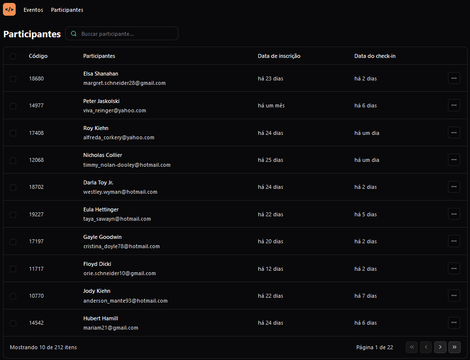

# Pass-in-Web



## Índice

- [Pré-requisitos](#pré-requisitos)
- [Instalação](#instalação)
- [Utilização](#utilização)
- [Contribuição](#contribuição)
- [Créditos](#créditos)
- [Contato](#contato)

## Pré-requisitos

- Node.js (versão 12 ou superior)
- Bun ou npm

## Instalação

1. Clone o repositório para seu ambiente local:

```
git clone https://github.com/Wallauerr/pass-in-web.git
```

2. Acesse o diretório do projeto:

```
cd pass-in-web
```

3. Instale as dependências do projeto:

```
bun i
```

4. Inicie a aplicação:

```
bun run dev
```

5. A aplicação iniciará o navegador padrão. Caso isso não aconteça, acesse [http://localhost:5173](http://localhost:5173)

## Utilização

1. Clique em qualquer participante.
2. Pesquise por qualquer participante.
3. Navegue pelas páginas.

## Contribuição

Apesar de ser um desafio para estudos contribuições são sempre bem-vindas! Siga as etapas abaixo para contribuir com este projeto:

1. Dê um fork este repositório.
2. Crie uma nova branch com sua feature/correção:

```
git checkout -b nome-da-sua-branch
```

3. Realize as alterações e commits:

```
git commit -m "tipoDeModificação: Descrição das suas alterações"
```

Tipos de modificação: feat, fix, etc...

4. Envie as alterações para o fork do repositório:

```
git push origin nome-da-sua-branch
```

5. Abra um Pull Request neste repositório (original).

## Créditos

- [TypeScript](https://www.typescriptlang.org/)
- [React](https://react.dev/)
- [Tailwindcss](https://tailwindcss.com/)
- [Fakerjs](https://fakerjs.dev/)
- [Dayjs](https://day.js.org/en/)
- [Lucide icons](https://lucide.dev/)
- [Figma layout](https://www.figma.com/community/file/1356738933008624188)
- [Rocketseat](https://www.rocketseat.com.br/)

## Contato

Se tiver alguma dúvida ou sugestão, você pode entrar em contato comigo por meio do email: wallauer@protonmail.com